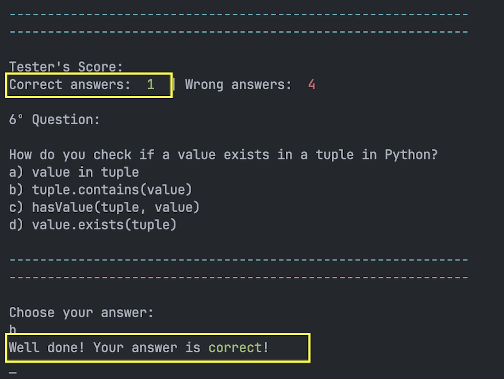

# Python Quiz

Prepare for the Python Quiz, a lively 10-question multiple-choice test designed for Python newcomers! Although we have 30 questions in the database, each quiz session randomly selects 10. If you're teaching Python courses, think about incorporating this quiz to captivate your students and identify areas where they might benefit from some extra assistance. The results are conveniently stored in an external file, allowing for easy visualization through user-friendly spreadsheet functionality. Let's simplify the journey of mastering Python!

- - -

## Demo

You can explore a live demonstration [here](https://project3-python-quiz-5f0c6fd0bce1.herokuapp.com/).
The application has been deployed using Heroku.

- - -

# Technologies Used
## Language
* Python3

## Libraries
* colorama
* pyfiglet
* time
* gspread
* google.oauth2.service_account
* random

## Frameworks & Tools
* Heroku Platform: Deployment of the application in a live environment.
* Visual Studio Code: Creation of the website.
* GitHub: Repository storage and deployment of the website.
* Google Sheets API: Handling data automation.
* [Lucidchart](https://www.lucidchart.com/) - to draw a flowchart.

- - -

For this project, I utilized a [Code Institute template](https://github.com/Code-Institute-Org/python-essentials-template), which supplied all the necessary files to enable the mock terminal functionality in the browser.

The questions and options are extracted from the "questions" worksheet, which stores 30 general questions. User history is updated in the "history" worksheet.

* Question Worksheet:
* 

* History Worksheet:
* 

- - - 

# User Experience (UX)

## The ideal users for this website is:
* Users learning Python who wish to assess their knowledge.

## User stories:

* As a new user, I expect to quickly comprehend the program's purpose.

* I wish for clear instructions on how to participate in the quiz.
* I expect precise feedback based on my inputs.
* I would like the choice to either replay the quiz or exit the program.
* I expect the ability to restart the quiz.

## How to play:

- Initially, the user is required to input a valid name to commence the game.
- Subsequently, the user can review the instructions.
- Following that, the quiz initiates, and the user must select a, b, c, or d as their choice.
- The score increases by one for each correct choice or incorrect one.
- After finishing the 10 random questions, the user's score will be shown in the terminal and stored in the history worksheet.
- Finally, the user will be given the choice to either play again or exit the program.

- - -

# Design

With the incorporation of a template in the front-end files, users can interact with this project using a simulated terminal on a web page. No alterations were necessary in other files.

## Lucid Chart
Lucid was used to create this flowchart, providing a concise representation of the application's structure and logic.

## Existing Features

### Introduction
- When the program is executed, users are presented with the welcome screen for the Python Quiz, prompting them to enter their username.

- Once the user inputs a name, the game rules and instructions are presented.

### Quiz

- After the instructions are displayed, the quiz begins automatically. Questions are presented sequentially, each with four options. Users are instructed to choose from options a, b, c, or d. Additionally, each question displays the current score to the user.

### Feedback on each question

- When the user makes a valid choice, the system will indicate whether the response is correct or incorrect.

* Correct answer

* Wrong answer

- In case of an invalid input, the user will be prompted repeatedly until a valid choice is made.

* Invalid answer input

### Update the history worksheet

- After each play, the user's gameplay data will be recorded in the history worksheet.

### Score

- Following the completion of 10 random questions, the score will be shown.

* Good score

* Medium score

* Bad score

### Try again

- After completing the quiz, the user will be asked about their preference to play again or not.

- If the user decides to play again, a message encouraging another attempt will be shown for 3 seconds. Subsequently, the quiz will start again.

- If the user chooses not to play again, a thank you message will be presented, and the application will exit.

## Future Implementations
- Different levels of questions
- Allow users to choose quiz topics or categories before starting the quiz.
- Integrate additional learning resources such as explanations, hints, or references for each question.
- Implement timed quizzes where users need to answer questions within a specified time limit.

- - -