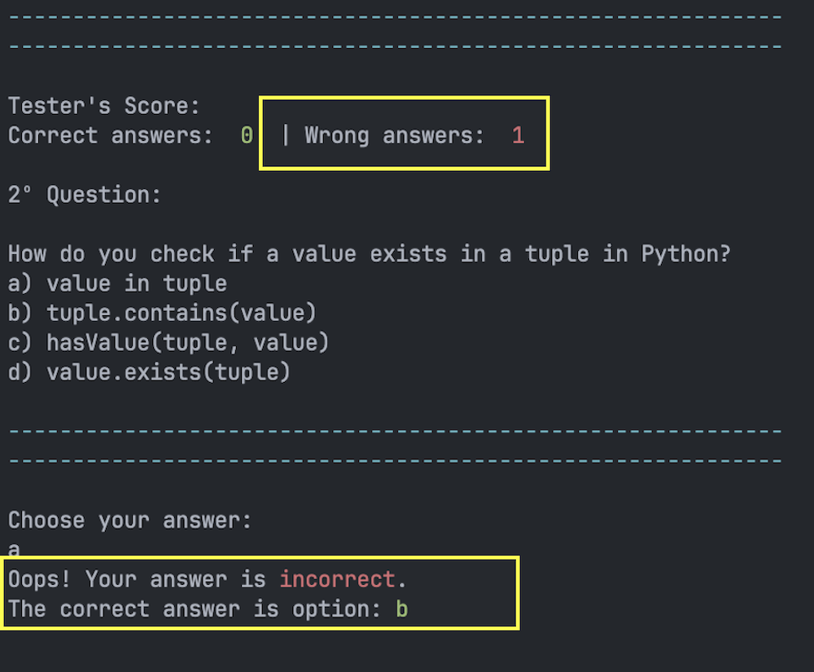

# Python Quiz

Prepare for the Python Quiz, a lively 10-question multiple-choice test designed for Python newcomers! Although we have 30 questions in the database, each quiz session randomly selects 10. If you're teaching Python courses, think about incorporating this quiz to captivate your students and identify areas where they might benefit from some extra assistance. The results are conveniently stored in an external file, allowing for easy visualization through user-friendly spreadsheet functionality. Let's simplify the journey of mastering Python!

- - -


## Demo

You can explore a live demonstration [here](https://project3-python-quiz-5f0c6fd0bce1.herokuapp.com/).
The application has been deployed using Heroku.

- - -

# Contents
* [Technologies Used](#technologies-used)
* [User Experience](#user-experience-ux)
* [Design](#design)
  * [Lucid Chart Flowchart](#lucid-chart)
  * [Existing Features](#existing-features)
  * [Future Implementations](#future-implementations)
* [Deployment](#deployment)
  * [Heroku Deployment](#heroku-deployment)
  * [Run locally](#run-locally)
* [Testing](#testing)
* [Credits](#credits)
* [Acknowledgements](#acknowledgements)

- - -

# Technologies Used
## Language
* Python3

## Libraries
* colorama
* pyfiglet
* time
* gspread
* google.oauth2.service_account
* random

## Frameworks & Tools
* Heroku Platform: Deployment of the application in a live environment.
* Visual Studio Code: Creation of the website.
* GitHub: Repository storage and deployment of the website.
* Google Sheets API: Handling data automation.
* [Lucidchart](https://www.lucidchart.com/) - to draw a flowchart.

- - -

For this project, I utilized a [Code Institute template](https://github.com/Code-Institute-Org/python-essentials-template), which supplied all the necessary files to enable the mock terminal functionality in the browser.

The questions and options are extracted from the "questions" worksheet, which stores 30 general questions. User history is updated in the "history" worksheet.

* Question Worksheet:
* 

* History Worksheet:
* 

- - - 

# User Experience (UX)

## The ideal users for this website is:
* Users learning Python who wish to assess their knowledge.

## User stories:

* As a new user, I expect to quickly comprehend the program's purpose.


* I wish for clear instructions on how to participate in the quiz.
* I expect precise feedback based on my inputs.
* I would like the choice to either replay the quiz or exit the program.
* I expect the ability to restart the quiz.

## How to play:

- Initially, the user is required to input a valid name to commence the game.
- Subsequently, the user can review the instructions.
- Following that, the quiz initiates, and the user must select a, b, c, or d as their choice.
- The score increases by one for each correct choice or incorrect one.
- After finishing the 10 random questions, the user's score will be shown in the terminal and stored in the history worksheet.
- Finally, the user will be given the choice to either play again or exit the program.

- - -

# Design

With the incorporation of a template in the front-end files, users can interact with this project using a simulated terminal on a web page. No alterations were necessary in other files.

## Lucid Chart
Lucid was used to create this flowchart, providing a concise representation of the application's structure and logic.


## Existing Features

### Introduction
- When the program is executed, users are presented with the welcome screen for the Python Quiz, prompting them to enter their username.


- Once the user inputs a name, the game rules and instructions are presented.


### Quiz

- After the instructions are displayed, the quiz begins automatically. Questions are presented sequentially, each with four options. Users are instructed to choose from options a, b, c, or d. Additionally, each question displays the current score to the user.


### Feedback on each question

- When the user makes a valid choice, the system will indicate whether the response is correct or incorrect.

* Correct answer will be incremented by one at the top of the screen.


* Wrong answer will be incremented by one at the top of the screen. Towards the end, the correct option will be revealed.


- In case of an invalid input, the user will be prompted repeatedly until a valid choice is made.

* Invalid answer input


### Update the history worksheet

- After each play, the user's gameplay data will be recorded in the history worksheet.


### Score

- Following the completion of 10 random questions, the score will be shown.

* Good score


* Medium score


* Bad score


### Try again

- After completing the quiz, the user will be asked about their preference to play again or not.


- If the user decides to play again, a message encouraging another attempt will be shown for 3 seconds. Subsequently, the quiz will start again.


- If the user chooses not to play again, a thank you message will be presented, and the application will exit.


- - -

## Future Implementations
- Different levels of questions
- Allow users to choose quiz topics or categories before starting the quiz.
- Integrate additional learning resources such as explanations, hints, or references for each question.
- Implement timed quizzes where users need to answer questions within a specified time limit.

- - -

# Deployment

The code for this project was written in Visual Studio Code because of technical issues with Gitpod. Subsequently, the application was deployed from GitHub to Heroku, following a step-by-step process, with active version releasing.

Follow these deployment steps after setting up your Heroku account:

Click on "New" in the top-right corner of your Heroku Dashboard and choose "Create new app" from the dropdown menu.
Provide a unique app name and select a region (EU or USA).
Click "Create App."
To enable the project to run on Heroku, install the dependencies by executing the following command in the terminal:

`pip3 freeze > requirements.txt`
This command generates a list of requirements in the `requirements.txt` file.

To secure sensitive data, the creds.json file is protected in the gitignore file. These credentials are necessary for connecting to the API. Follow these steps to allow the Heroku Application to access the spreadsheet:

From the new app's Settings, click "Reveal Config Vars."
Set the value of KEY to CREDS (all capital letters), copy the entire creds.json from the repository, and paste it into the VALUE field. Click "Add."
To support dependencies, select "Add Buildpack."
Ensure Python is the first buildpack and Node.js is the second.
Go to the "Deploy" section and select "GitHub" under "Deployment method."
Enter your repository name, click 'Search,' and then 'Connect' when it appears below.
Choose the branch you want to build your app from.
Optionally, click on "Enable Automatic Deploys" to keep the app up to date with your GitHub repository.
Wait for the app to build. Once ready, you'll see the “App was successfully deployed” message with a 'View' button to take you to your deployed link.

## Run locally

**Making a Local Clone**

1. Log in or sign up on GitHub.
2. Open the project [repository](https://github.com/MaikonSchumann/portfolio-project3-python-quiz).
3. Access the project repository.
4. Click on the "Code" button, choose whether to clone with HTTPS, SSH, or GitHub CLI, and copy the provided link.
5. Open the terminal in your preferred code editor and navigate to the desired location for the cloned directory.
6. Enter 'git clone' in the terminal, then paste the link from step 3. Press enter.

Stage the files in your fresh local repository, preparing them for the initial commit.

```bash
$ git add .
```

To remove a file from the staging area, utilize:

```bash
$ git reset HEAD YOUR-FILE
```

Commit the staged files in your local repository:

```bash
$ git commit -m "First commit"
# Commits the tracked changes and readies them for pushing to a remote repository. To undo this commit and modify the file, employ 'git reset --soft HEAD~1', then commit and add the file again.
```

Push the changes from your local repository to GitHub.com:

```bash
$ git push origin main
# Pushes the changes in your local repository up to the remote repository you specified as the origin
```

**Forking the GitHub Repository**

To fork this repository for proposing changes or as inspiration for another project, follow these steps:

1. Log in or sign up on GitHub.
2. Open the project [repository](https://github.com/MaikonSchumann/portfolio-project3-python-quiz).
3. Click the "Fork" button in the top right corner.
4. A copy of the repository will now be available in your own GitHub account.

For deploying from GitHub, proceed with these steps:

1. Log into your GitHub repository; create an account if needed.
2. Click 'Settings' in the main Repository menu.
3. Navigate to 'Pages' in the left-hand side navigation menu.
4. In the Source section, click the "Branch" button and change from 'None' to 'Main'.
5. The page should automatically refresh, displaying a URL.
6. Test the link by clicking on the URL.

The url for this website can be found [here](https://project3-python-quiz-5f0c6fd0bce1.herokuapp.com/).

- - -

# Testing 

The site's different features operate as intended, ensuring users can easily accomplish their goals with expected outcomes. The terminal played a crucial role in the application's development, used to identify and resolve issues while testing both correct and incorrect user inputs.

## Functionality
### Validator

The project was validated using the CI Python Linter, and no significant errors were detected.

Although some errors were noted in the linter related to function descriptions and game rules (E501 line too long), they have been deliberately retained as part of the game's description. It's important to acknowledge that in a professional context, certain errors may not be acceptable for file uploads. However, for the purposes of this study project, these errors have been preserved.


### Manual: 

|N.| Test Label | Test Action | Expected Outcome | Test Outcome |
|:---|:--- |:--- |:--- |:--- |
|01| Type username | In the input field, capture the user input and store it in a global variable named "username." | The username has been saved, and the application proceeds.| PASS |
|02| Quiz questions| The quiz begins with the first question. After a valid choice from the user, the next question is presented, with questions randomly selected from the questions worksheet.| All questions are accurately presented.| PASS |
|03| Valid user's choice | In the input field, try entering a valid choice (a, b, c, or d).| The choice is valid, and the quiz proceeds.| PASS |
|04| Invalid user's choice | In the input field, try entering an invalid choice (number, empty, or other invalid characters).| The choice is invalid, and the user must enter a valid choice to proceed with the quiz.| PASS |
|05| Check answer| Receive the valid user input. | Verify if the user's guess matches the correct answer in the questions worksheet or not.| PASS |
|06| Show the correct answer| Type a correct answer | It shows a message confirming the correct choice, and increments the correct_score by +1.| PASS |
|07| Show the incorrect answer| Type a incorrect answer | It shows a message confirming the incorrect choice, displays the correct option, and increments the wrong_score by +1.| PASS |
|08| Update history worksheet | After 10 random questions, the program updates the user's gameplay score in the history worksheet on PythonQuizDataBase.| The current gameplay score will be stored on history worksheet.| PASS |
|09| Final message score >= 7 | Score 7 or more  | It displays a congratulation message correctly | PASS |
|10| Final message score <= 4 | Score 4 or less  | It shows an encouraging message inviting the user to study a little more try the quiz again. | PASS |
|11| Final message score < 7 and > 4 | Score between 4 - 7  | It shows an encouraging message to attempt the quiz again.| PASS |
|12| Valid Try again Input (Y/N) | Type a valid option (Y/N) | The input is correct and the program proceeds| PASS |
|13| Invalid Try again Input (Y/N) | Type invalid option (Y/N) | A valid input is required| PASS |
|14| Play again | The user indicates a wish to play again by entering 'y'.| Display a "Try again" message, and the quiz restarts.| PASS |
|15| Play again | The user chooses not to play again and inputs 'n'.| Display a "Game Over" message, and the quiz ends.| PASS |
|16| Colors | When run the quiz | Text colors are displayed according to code | PASS |

## Compatibility
The website displays correctly across different browsers and screen sizes.

- - - 

# Credits
## Code
The following sources were used for this project:
- Python Essentials from [Code Institute](https://codeinstitute.net/)
- [Gspread](https://docs.gspread.org/en/latest/user-guide.html#getting-all-values-from-a-row-or-a-column)
- [Develop Google Sheets solutions](https://developers.google.com/sheets/api/guides/values)
- [Pyfiglet](https://www.javatpoint.com/python-pyfiglet-module#:~:text=We%20can%20use%20the%20functions,import%20pyfiglet%20as%20pfg)
- [Markdown Guide](https://www.markdownguide.org/extended-syntax/#tables)
- [Colorama Guide](https://pypi.org/project/colorama/)
- [Boilerplate Guide](https://stackoverflow.com/questions/419163/what-does-if-name-main-do)

- - -

# Acknowledgements
* I appreciate my family's patience as I dedicate considerable time to coding.

* My Mentor Lauren-Nicole Popich for continuous helpful feedback.

- - -